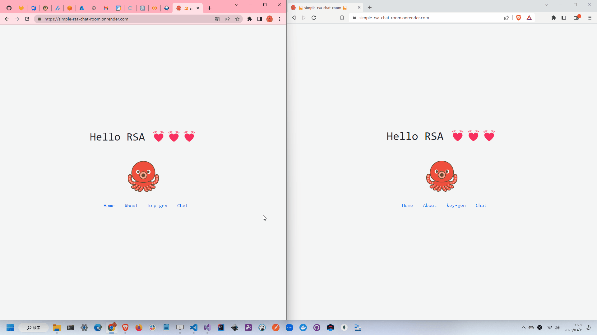

# simple-rsa-chat-room

🦩🦩🦩 RSA暗号を使用して暗号化された通信でチャットを行うことができるWEBサイトです。  
送信時には公開鍵を使用して暗号化し、受信時には秘密鍵を使用して復号化します。  

  

素数には10から100までの数字を選択してください。  
アンダーフロー、オーバーフローを防ぐためです。  

## 実行方法

```shell
docker build -t simple-rsa-chat-room .
docker run -it -p 8000:8000 --name simple-rsa-chat-room simple-rsa-chat-room
```
